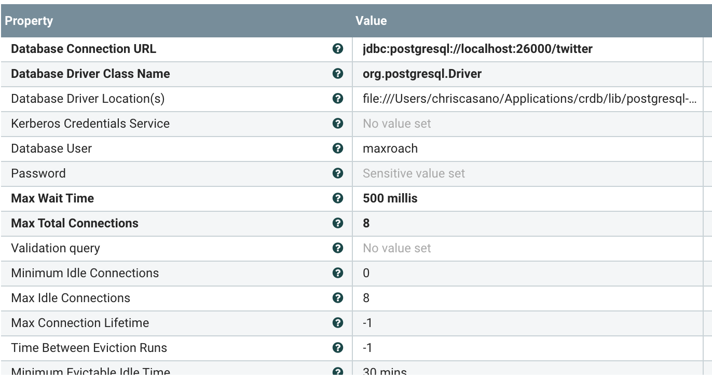

<b>Tweets to CockroackDB</b>

This repo quickly demonstrates how to get tweets and insert them into CockroackDB.  This was done using NiFi 1.9.2 and CockroackDB 19.1.5

<b>Roadmap</b>

- A NiFi flow for Change Data Capture (CRDB -> NiFi -> Wherever)
- Geo-Partitioning of Tweets because...why not

<b>Get Postgresql Driver</b>
https://jdbc.postgresql.org/download.html
Place somewhere where the user running NiFi has read access.  Do not place in the /lib directory of NiFi.

<b>CockroackDB Setup</b>

`cockroach sql --certs-dir=$(CERT_PATH) --host=localhost:26000 < twitter.sql`

<b>NiFi Setup</b>

You can quickly use Homebrew to install NiFi if on a Mac

`brew install nifi`

(but you do need JDK8)

...or you can download it from Apache or Cloudera

Once NiFi is running, you can import the tweets2crdb.xml template in this repo.  Once imported, you'll have to configure the 

<b>Configure NiFi Controller Services</b>

Avro Reader

AvroRecordSetWriter

DBCPConnectionPool

JsonPathReader

